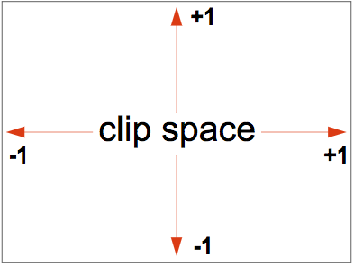

## [용어](https://webglfundamentals.org/webgl/lessons/ko/webgl-fundamentals.html)

- ##### WebGL

  > Web Graphics Library, OpenGL ES 2.0을 대부분 충족하는 API를 제공
  >
  > 대부분의 WebGL API는 함수 쌍 실행을 위한 상태 설정에 관한 것입니다. 당신이 원하는 것을 그리기 위해서는 여러 상태를 설정하고 GPU에서 Shader를 실행하는 `gl.drawArrays` 또는 `gl.drawElements`을 실행해야 합니다.

- ##### Vertex Shader

  > Vertex Shader의 역할은 Vertex 위치들을 계산하는 겁니다. 출력 위치에 따라서 WebGL은 점, 선, 삼각형을 포함한 다양한 종류의 Primitive를 Rasterization 할 수 있습니다. 이 Primitive들을 rasterization하면 Fragment Shader 함수를 두 번째로 호출합니다. 

- ##### Fragment Sahder

  > Fragment Shader의 역할은 현재 그려진 Primitive의 모든 화소에 색을 계산하는 겁니다.

- ##### Buffer

  > Buffer는 GPU에 올리는 2진 데이터 배열입니다. 일반적으로 Buffer는 위치, 법선, Texture 좌표, Vertex 색상 등을 포함하지만 당신이 원하는 것을 자유롭게 넣어도 됩니다.

- ##### Attribute

  > Attribute는 어떻게 Buffer에서 데이터를 가져오고 Vertex Shader에 제공할지 방법을 지정하는데 사용됩니다. 예를 들어 3개의 32bit 부동 소수점으로 각각의 위치를 buffer에 넣을 수 있는데요. 특정한 Attribute에게 어느 Buffer에서 위치를 가져올지, 어떤 데이터 형식을 가져와야 하는지 (3개의 32bit 부동 소수점), Buffer의 어디에서 offset이 시작되는지 그리고 한 위치에서 다음 위치로 얼마나 많은 바이트를 이동시킬 것인지 알려줘야 합니다.

- ##### Uniform

  > Uniform은 Shader Program을 실행하기 전에 선언하는 유용한 전역 변수입니다.

- ##### Texture

  > Texture는 Shader Program이 무작위로 접근할 수 있는 데이터 배열입니다. 일반적으로 Texture에 들어가는 것은 대부분 이미지 데이터지만 색상 이외에 다른 것도 쉽게 넣을 수 있습니다.

- ##### Varying

  > Varying는 Vertex Shader가 Fragment Shader에 데이터를 넘기는 방법입니다. 렌더링 되는 점, 선 또는 삼각형에 따라 Vertex Shader의 Varying 값은 Fragment Shader를 실행하는 동안 보간됩니다.

- ##### precision

  > 정밀도 'lowp, 'mediump' or 'highp'

- ##### Drawing Buffers

  - ###### Color Buffer: 색상과 투명도 정보

  - ###### Depth Buffer: 각 픽셀의 앞면과 뒷면을 나타내는 심도 정보

  - ###### Stencil Buffer: 랜더링 영역의 경계정보 (영역만 랜더링)

- ##### Primitive Type

  > 7가지 기본 Vertex 타입

  - POINTS
  - LINES
  - LINE_STRIP
  - LINE_LOOP
  - TRIANGLES
  - TRIANGLS_STRIP
  - TRIANGLE_FAN

- ##### clip 공간 좌표

  > canvas 크기에 상관없이 항상 `-1`에서 `+1`까지 사용

  


## 소스 설명

```js
src
│
├── shader : 쉐이더 폴더
│   ├── compileProgram.js : 
│   ├── defaultValue.js : 
│   ├── extractAttributes.js : 
│   ├── extractUniforms.js : 
│   ├── generateUniformAccessObject.js : 
│   ├── index.js : 
│   ├── mapSize.js : 
│   ├── mapType.js : 
│   └── setPrecision.js : 
│
├── createContext.ts : WebGL 컨텍스트 생성
├── GLBuffer.ts : Buffer 생성 헬퍼 클래스
├── GLFramebuffer.ts : Framebuffer 생성 핼퍼 클래스
├── GLShader.ts : Shader 생성 핼퍼 클래스
├── GLTexture.ts : 
├── index.js : 
├── setVertexAttribArrays.ts : 
└── VertexArrayObject.ts : 

```


## GLBuffer.js

> WebGL Buffer 생성 핼퍼 클래스

Buffer는 GPU에 올리는 2진 데이터 배열입니다. 일반적으로 Buffer는 위치, 법선, Texture 좌표, Vertex 색상 등을 포함하지만 당신이 원하는 것을 자유롭게 넣어도 됩니다.


##### type

- ###### gl.ARRAY_BUFFER

  > 위치 및 색상 정점 어트리뷰트에 사용

- ###### gl.ELEMENT_ARRAY_BUFFER

  > 버퍼가 정점 인덱스를 포함할 때 사용


##### drawType

- ###### gl.STATIC_DRAW

  > 데이터를 1번만 설정하고 애플리케이션이 여러 번 사용하 는 동안 다시 변경하지 않음

- ###### gl.DYNAMIC_DRAW

  > 애플리케이션에서 데이터를 여러 번 사용하지만 매번 내용을  재설정

- ###### gl.STREAM_DRAW

  > 데이터를 변경하지 않는다는 점에서 STATIC_DRAW와 유사하지만 애플리케이션에서 기껏해야 몇 차례만 사용


##### data

- ###### ArrayBuffer

  > **`ArrayBuffer`**객체는 일반적인 길이가 정해진 원시 이진 데이터 버퍼를 나타내는 데 쓰입니다. `ArrayBuffer`에 담긴 정보를 직접 수정하는 것은 불가능하지만, 대신 [TypedArray](https://developer.mozilla.org/ko/docs/Web/JavaScript/Reference/Global_Objects/TypedArray)나 특정 포맷의 버퍼를 나타내는 [`DataView`](https://developer.mozilla.org/ko/docs/Web/JavaScript/Reference/Global_Objects/DataView)를 생성하고 그것을 이용해 버퍼의 내용물을 읽고 쓸 수 있습니다.

- ###### SharedArrayBuffer

  > [SharedArrayBuffer 객체](https://developer.mozilla.org/en-US/docs/Web/JavaScript/Reference/Global_Objects/SharedArrayBuffer)는 길이가 고정된(fixed-length) 바이너리 데이터 버퍼다. [ArrayBuffer 객체](https://developer.mozilla.org/en-US/docs/Web/JavaScript/Reference/Global_Objects/ArrayBuffer)와 유사하지만 공유된 메모리에 뷰를 생성할 때 사용할 수 있다.
  >
  > 웹에서 작업을 병렬적으로 실행하는 기본적인 방법은 Web Workers를 사용하는 것이다. 그러나 worker는 각자 분리된 전역 환경에서 실행되기 때문에 worker(또는 메인 스레드) 간 통신을 통한 간접적인 형태 외에는 데이터가 직접 공유되지 않았다.
  >
  > SharedArrayBuffer 객체는 에이전트(메일 스레드, worker 등)가 데이터를 공유할 수 있게 한다.

- ###### ArrayBufferView

  > ArrayBufferView 는 다음 타입의 추상 형식 [`DataView`](https://www.javascripture.com/DataView), [`Float32Array`](https://www.javascripture.com/Float32Array), [`Float64Array`](https://www.javascripture.com/Float64Array), [`Int8Array`](https://www.javascripture.com/Int8Array), [`Int16Array`](https://www.javascripture.com/Int16Array), [`Int32Array`](https://www.javascripture.com/Int32Array), [`Uint8Array`](https://www.javascripture.com/Uint8Array), [`Uint8ClampedArray`](https://www.javascripture.com/Uint8ClampedArray), [`Uint16Array`](https://www.javascripture.com/Uint16Array), [`Uint32Array`](https://www.javascripture.com/Uint32Array).

  ArrayBufferView는 자체 설명형 이름이 있으며 `Int8`, `Uint32`, `Float64` 등과 같은 모든 일반 숫자 형을 위한 뷰를 제공합니다. 특별한 형식화 배열 뷰가 하나 있습니다, `Uint8ClampedArray`. 값은 0에서 255 사이로 단속(제한)합니다. 예를 들어, 이는 [Canvas 데이터 처리](https://developer.mozilla.org/ko/docs/Web/API/ImageData)에 유용합니다.

| 유형                                                         | 크기 (바이트) | 설명                                | Web IDL 형            | 해당 C 형  |
| ------------------------------------------------------------ | ------------- | ----------------------------------- | --------------------- | ---------- |
| `Int8Array`                                                  | 1             | 8비트 2의 보수 형식 부호 있는 정수  | `byte`                | `int8_t`   |
| `Uint8Array`                                                 | 1             | 8비트 부호 없는 정수                | `octet`               | `uint8_t`  |
| `Uint8ClampedArray`                                          | 1             | 8비트 부호 없는 정수 (단속됨)       | `octet`               | `uint8_t`  |
| `Int16Array`                                                 | 2             | 16비트 2의 보수 형식 부호 있는 정수 | `short`               | `int16_t`  |
| [`Uint16Array`](https://developer.mozilla.org/ko/docs/Web/JavaScript/Reference/Global_Objects/Uint16Array) | 2             | 16비트 부호 없는 정수               | `unsigned short`      | `uint16_t` |
| `Int32Array`                                                 | 4             | 32비트 2의 보수 형식 부호 있는 정수 | `long`                | `int32_t`  |
| `Uint32Array`                                                | 4             | 32비트 부호 없는 정수               | `unsigned long`       | `uint32_t` |
| `Float32Array`                                               | 4             | 32비트 IEEE 부동 소수점 수          | `unrestricted float`  | `float`    |
| `Float64Array`                                               | 8             | 64비트 IEEE 부동 소수점 수          | `unrestricted double` | `double`   |


## GLFramebuffer.js

> WebGL [Framebuffer](https://webgl2fundamentals.org/webgl/lessons/ko/webgl-image-processing-continued.html) 생성 헬퍼 클래스

이미지를 렌더링하는 데 사용되는 색상, 알파, 깊이 및 스텐실 버퍼의 컬렉션 버퍼 데이터 저장


##### 속성

- ###### stencil {WebGLRenderbuffer}

- ###### texture {PIXI.glCore.GLTexture}

##### enableTexture 함수

- ###### gl.framebufferTexture2D(gl.FRAMEBUFFER, gl.COLOR_ATTACHMENT0, gl.TEXTURE_2D, this.texture.texture, 0);

##### enableStencil 함수

- ###### gl.framebufferRenderbuffer(gl.FRAMEBUFFER, gl.DEPTH_STENCIL_ATTACHMENT, gl.RENDERBUFFER, this.stencil);

- ###### gl.renderbufferStorage(gl.RENDERBUFFER, gl.DEPTH_STENCIL,  this.width  , this.height );


## GLShader.js

##### 전역 객체

- ###### compileProgram

- ###### extractAttributes

  > 프로그램에 사용되는 전체 Attribute를 반환

  - `var totalAttributes = gl.getProgramParameter(program, gl.ACTIVE_ATTRIBUTES);`

- ###### extractUniforms

- ###### setPrecision

- ###### generateUniformAccessObject


## GLTexture.js


## VertexArrayObject.js